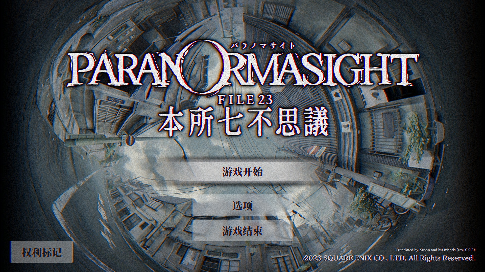
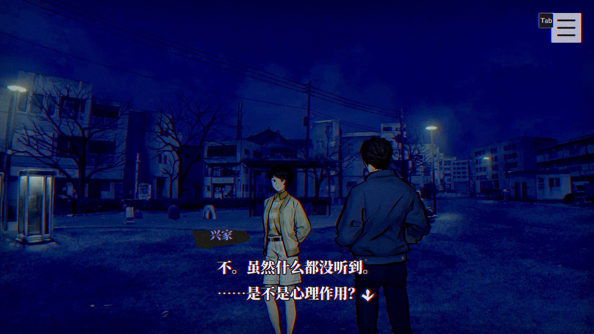
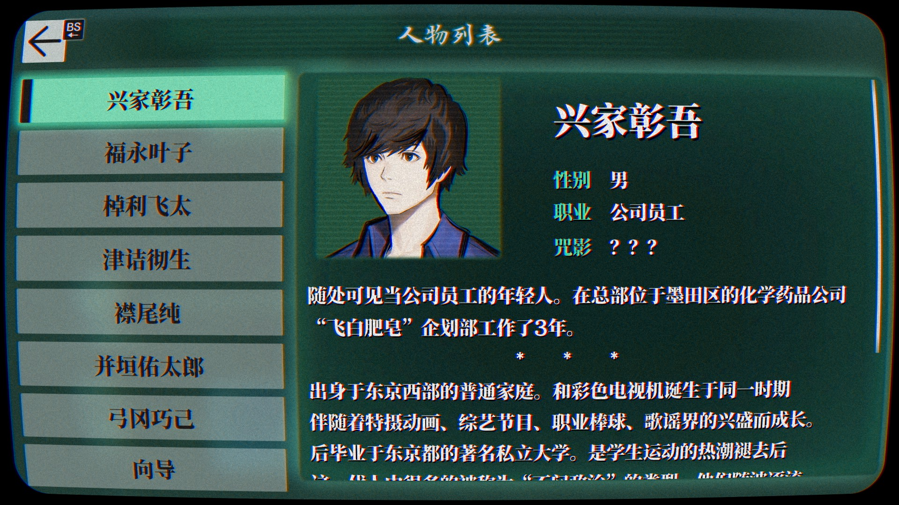

# 《灵异视界 FILE23 本所七大不可思议》文本翻译汉化

 

## 基本说明
本项目是对《灵异视界 FILE23 本所七大不可思议》（パラノマサイト FILE23 本所七不思議，*PARANORMASIGHT: The Seven Mysteries of Honjo*）的文本翻译汉化。所有文本基于 [百度翻译](https://fanyi.baidu.com/) 和 [有道翻译](https://fanyi.youdao.com/) **机翻汉化**，并进行了一些修正。

本补丁基于 Steam 版制作，理论上可用于其他平台版本，但未经测试。

## 更新历史
- 0.9.3（2023-06-29）：
  - 增加了自制的中文Logo。
  - 更新了字库，修复了几处缺字的问题。
- 0.9.2（2023-06-23）：
  - 修改了游戏开始时询问名字的流程，使其更合理。
  - 游戏中需要输入名字的地方现在可以识别简体中文和拼音。**注意：由于存储空间的原因，使用补丁后输入假名会被视为错误答案，可改用日文汉字或罗马音输入。**（0.9.1版本由于代码原因，实际上未实现此功能。）
- 0.9.1（2023-06-20）：
  - 在标题页面新增了版本号标识。

## 使用方式
请下载补丁，然后将补丁中的文件解压到游戏文件夹，并覆盖对应的文件。若为开发版本，请分别下载字体补丁（`patch-font.zip`）和文本补丁（`patch-text.zip`）。如果应用补丁时未提示覆盖文件夹，请确认补丁解压的位置是否正确。在游戏中需要选择“日语”作为语言。

## 已知问题
- **由于游戏本身的限制，一些字符无法输入到文本框中。游戏开始阶段输入名字时，请尽可能重新输入并确认，以免游戏直接读取Steam昵称导致无法输入。如果您已经遇到了这个问题，请尝试暂时修改Steam昵称。**

## 相关链接
- **[>>> 0.9.3 版本补丁下载地址 <<<](https://github.com/Xzonn/ParanormasightChsLocalization/releases/download/0.9.3/patch-0.9.3.zip)**
- [开发版本补丁下载](https://github.com/Xzonn/ParanormasightChsLocalization/releases/tag/publish)
- [补丁生成工具](https://github.com/Xzonn/ParanormasightChsLocalizationHelper)
- [翻译项目网站](https://weblate.xzonn.top/projects/paranormasight/)

## 截图预览
  
  

