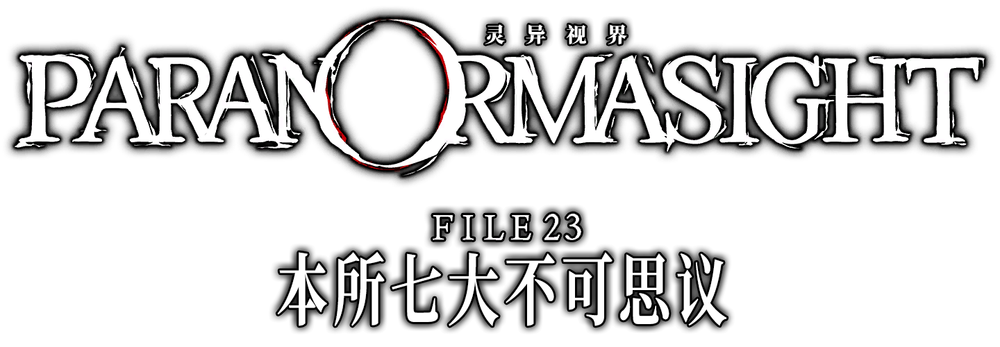
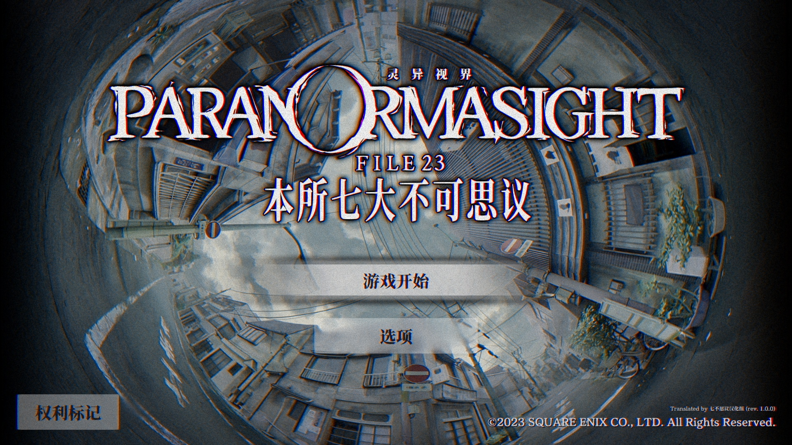

# [《灵视异闻（灵异视界） FILE23 本所七大不可思议》非官方汉化](https://xzonn.top/ParanormasightChsLocalization/)

**官方已宣布将会更新简体中文和繁体中文，标题为《灵视异闻 FILE23 本所七大不可思议》，敬请期待官方汉化！**

## 汉化名单
**七不思议汉化组 汉化**
- **翻译**：Xzonn、九条期会、废物回收社社长、kibana00、ISARAIRO、Momo、包子嘛馅儿、载颐、豆、÷4上帝、皂滑弄人、shirashima、SSeP、陆渊
- **测试**：Xzonn

## 基本说明
**注意：本补丁仅用作技术交流，请用于正版游戏。**

本项目是对《灵视异闻（灵异视界） FILE23 本所七大不可思议》（パラノマサイト FILE23 本所七不思議，*PARANORMASIGHT: The Seven Mysteries of Honjo*）的简体中文本地化。

本补丁基于 Steam 及 Nintendo eShop 的 1.1 版制作（Steam 商店生成版本 ID：11663925），无法直接用于其他平台版本。

## 使用方式
### Steam 版本
请下载补丁，然后将补丁中的文件解压到游戏文件夹，并覆盖对应的文件。如果应用补丁时未提示覆盖文件夹，请确认补丁解压的位置是否正确。在游戏中需要选择“简体中文”作为语言。

参考视频：[BV1tM4y1x7nq](https://www.bilibili.com/video/BV1tM4y1x7nq/)。

### Nintendo eShop 版本
需要一台能够运行 [Atmosphere](https://github.com/Atmosphere-NX/Atmosphere) 自制固件（CFW）的 Nintendo Switch 主机。请下载补丁，然后将补丁中的文件解压到`SD:/atmosphere/contents/`文件夹下。在游戏中需要选择“简体中文”作为语言。

## 相关链接
- [本地化改动](https://github.com/Xzonn/ParanormasightChsLocalization/wiki/本地化改动)
- [更新历史](https://github.com/Xzonn/ParanormasightChsLocalization/wiki/更新历史)
- [常见问题](https://github.com/Xzonn/ParanormasightChsLocalization/wiki/常见问题)
- [补丁生成工具](https://github.com/Xzonn/ParanormasightChsLocalizationHelper)

## 截图预览
### Steam 版本
  
  

### Nintendo eShop 版本

## 授权协议
本项目使用 **[CC BY-NC-SA 4.0](https://creativecommons.org/licenses/by-nc-sa/4.0/legalcode)** 协议授权。若您想基于本项目进行二次创作，请遵守协议内容。这些内容主要包括：

- **署名**：您必须标明本项目的作者（七不思议汉化组），并在您的作品中提供指向本项目的链接。
- **非商业性使用**：您不得将本项目用于商业目的。
- **相同方式共享**：若您基于本项目进行二次创作，您必须以相同的协议授权您的作品。

请阅读本项目的 **[完整授权协议](LICENSE)** 以了解更多信息。