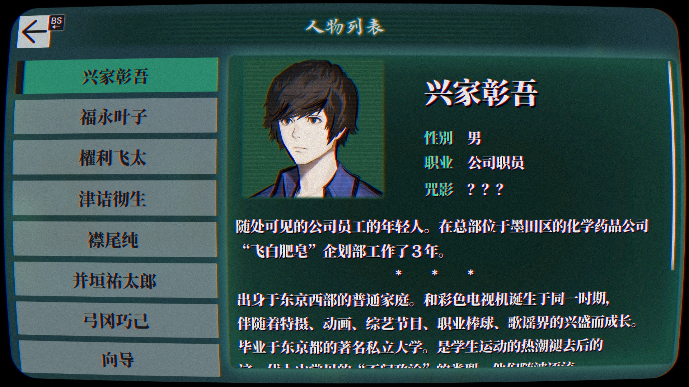

# 《灵异视界 FILE23 本所七大不可思议》汉化

 

## 基本说明
本项目是对《灵异视界 FILE23 本所七大不可思议》（パラノマサイト FILE23 本所七不思議，*PARANORMASIGHT: The Seven Mysteries of Honjo*）的简体中文本地化。

目前，本项目正处于校对阶段，仅供试玩。如遇到文字不通顺的地方，请等待后续版本或参与翻译校对。

本补丁基于 Steam 商店的 1.1 版制作（生成版本 ID：11663925），无法直接用于其他平台版本。

## 使用方式
请下载补丁，然后将补丁中的文件解压到游戏文件夹，并覆盖对应的文件。若为开发版本，请分别下载字体补丁（`patch-font.zip`）和文本补丁（`patch-text.zip`）。如果应用补丁时未提示覆盖文件夹，请确认补丁解压的位置是否正确。在游戏中需要选择“日语”作为语言。

参考视频：[BV1tM4y1x7nq](https://www.bilibili.com/video/BV1tM4y1x7nq/)。

## 本地化改动
参见：[本地化改动](https://github.com/Xzonn/ParanormasightChsLocalization/wiki/本地化改动)。

## 更新历史
参见：[更新历史](https://github.com/Xzonn/ParanormasightChsLocalization/wiki/更新历史)。

## 常见问题
参见：[常见问题](https://github.com/Xzonn/ParanormasightChsLocalization/wiki/常见问题)。

## 相关链接
- **[>>> 0.9.5 版本补丁下载地址 <<<](https://github.com/Xzonn/ParanormasightChsLocalization/releases/download/0.9.5/patch-0.9.5.zip)**
- [开发版本补丁下载](https://github.com/Xzonn/ParanormasightChsLocalization/releases/tag/publish)
- [补丁生成工具](https://github.com/Xzonn/ParanormasightChsLocalizationHelper)
- [翻译项目网站](https://weblate.xzonn.top/projects/paranormasight/)

## 截图预览
  
  

## 授权协议
本项目使用 **[CC BY-NC-SA 4.0](https://creativecommons.org/licenses/by-nc-sa/4.0/legalcode)** 协议授权。若您想基于本项目进行二次创作，请遵守协议内容。这些内容主要包括：

- **署名**：您必须标明本项目的作者（七不思议汉化组），并在您的作品中提供指向本项目的链接。
- **非商业性使用**：您不得将本项目用于商业目的。
- **相同方式共享**：若您基于本项目进行二次创作，您必须以相同的协议授权您的作品。

请阅读本项目的 **[完整授权协议](LICENSE)** 以了解更多信息。