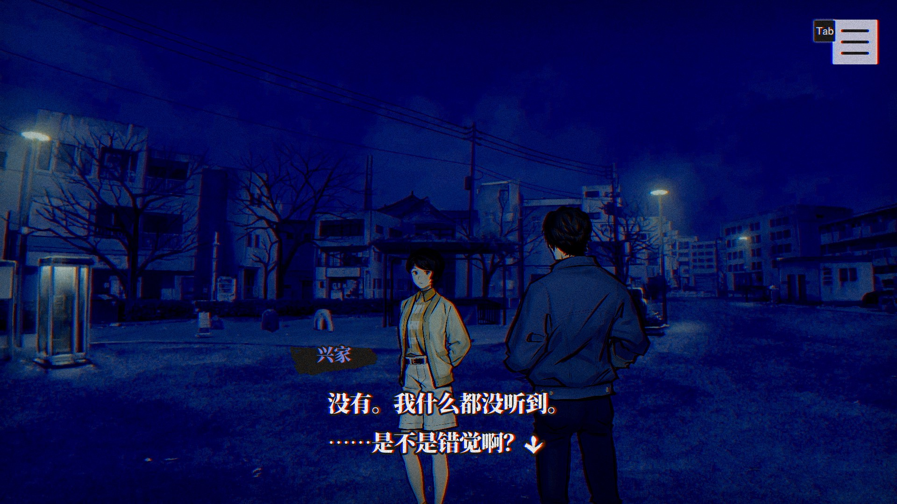

# 《灵异视界 FILE23 本所七大不可思议》汉化

 

## 基本说明
本项目是对《灵异视界 FILE23 本所七大不可思议》（パラノマサイト FILE23 本所七不思議，*PARANORMASIGHT: The Seven Mysteries of Honjo*）的简体中文本地化。

目前，本项目正处于校对阶段，仅供试玩。如遇到文字不通顺的地方，请等待后续版本或参与翻译校对。

本补丁基于 Steam 商店的 1.1 版制作（生成版本 ID：11663925），无法直接用于其他平台版本。

## 更新历史
- 0.9.5（2023-07-27）：
  - 匹配游戏 1.1 版本。
- 0.9.4（2023-07-09）：
  - 修改了“狐狗狸”的文字盘。
  - 改进了姓名输入的判断方式。
  - 更新了字库，由于之前版本选用的字体存在缺字问题，故更换字体。
- 0.9.3（2023-06-29）：
  - 增加了自制的中文Logo。
  - 更新了字库，修复了几处缺字的问题。
- 0.9.2（2023-06-23）：
  - 修改了游戏开始时询问名字的流程，使其更合理。
  - 游戏中需要输入名字的地方现在可以识别简体中文和拼音。**注意：由于存储空间的原因，使用补丁后输入假名会被视为错误答案，可改用日文汉字或罗马音输入。**（0.9.1 版本由于代码原因，实际上未实现此功能。）
- 0.9.1（2023-06-20）：
  - 在标题页面新增了版本号标识。

## 使用方式
请下载补丁，然后将补丁中的文件解压到游戏文件夹，并覆盖对应的文件。若为开发版本，请分别下载字体补丁（`patch-font.zip`）和文本补丁（`patch-text.zip`）。如果应用补丁时未提示覆盖文件夹，请确认补丁解压的位置是否正确。在游戏中需要选择“日语”作为语言。

## 本地化改动
### 关于游戏中输入的文本
游戏中有几处需要输入人名的地方，为了方便中文玩家输入，汉化版的这些地方均可以识别中文输入以及汉语拼音（不含声调）输入。例如，如果需要输入“佐藤太郎”这个人名（“佐藤”为姓氏，“太郎”为名字），则游戏可以识别以下中文相关输入（**大小写敏感、空格敏感**）：

- 佐藤
- Zuoteng
- zuoteng
- ZUOTENG
- 太郎
- Tailang
- tailang
- TAILANG
- 佐藤太郎
- Zuoteng Tailang
- zuoteng tailang
- ZUOTENG TAILANG

由于游戏的输入框限制非日文和英文字符输入，一些简体汉字可能无法正常识别，请尝试仅输入名字或使用汉语拼音。原版游戏可识别的日文汉字名字、英文罗马音名字也可以正常识别。

由于同一原因，游戏读取的 Steam 昵称可能无法在游戏的输入框中输入。如果 Steam 昵称中包含了无法输入的字符，并且在游戏最开始使用了 Steam 昵称作为自己的名字，请尝试暂时修改 Steam 昵称。

### 关于游戏中的“狐狗狸”

日文游戏中的棋盘使用了假名，英文游戏棋盘使用了字母。为了避免纯英文字母太长，汉化版的棋盘修改为了汉语拼音。这一改动仅为了方便理解，对游戏流程几乎没有影响。

## 相关链接
- **[>>> 0.9.5 版本补丁下载地址 <<<](https://github.com/Xzonn/ParanormasightChsLocalization/releases/download/0.9.5/patch-0.9.5.zip)**
- [开发版本补丁下载](https://github.com/Xzonn/ParanormasightChsLocalization/releases/tag/publish)
- [补丁生成工具](https://github.com/Xzonn/ParanormasightChsLocalizationHelper)
- [翻译项目网站](https://weblate.xzonn.top/projects/paranormasight/)

## 截图预览
  
  

## 授权协议
本项目使用 **[CC BY-NC-SA 4.0](https://creativecommons.org/licenses/by-nc-sa/4.0/legalcode)** 协议授权。若您想基于本项目进行二次创作，请遵守协议内容。这些内容主要包括：

- **署名**：您必须标明本项目的作者（七不思议汉化组），并在您的作品中提供指向本项目的链接。
- **非商业性使用**：您不得将本项目用于商业目的。
- **相同方式共享**：若您基于本项目进行二次创作，您必须以相同的协议授权您的作品。

请阅读本项目的 **[完整授权协议](LICENSE)** 以了解更多信息。